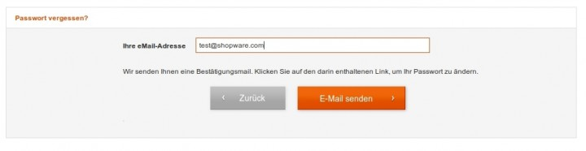
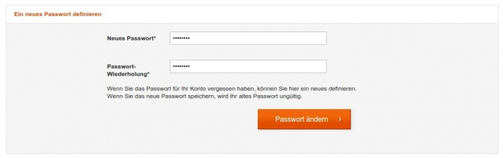

# SwagPasswordRestore

## Supported versions
Shopware version 4.1.4 to 4.3.6

## Description
Nowadays, the average internet user actively uses numerous accounts, sometimes each with different login data.
While not ideal, this data can get confused or lost.
With our new Forgotten Password function, you can help your customers reconnect with their account in only a few steps.

**How it works:**
after clicking on the “forgot password” prompt in the account login window, the system will send the customer an email with a time-sensitive password reset link.
After clicking the link, the customer will be sent to a landing page where they can create a new, secure password.

## Images

## License

The MIT License (MIT). Please see [License File](LICENSE) for more information.
